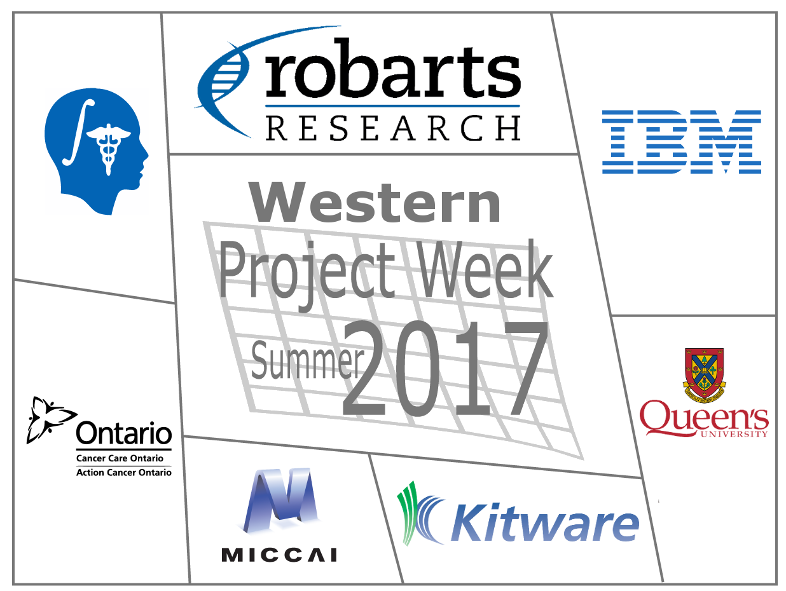
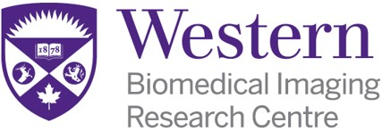
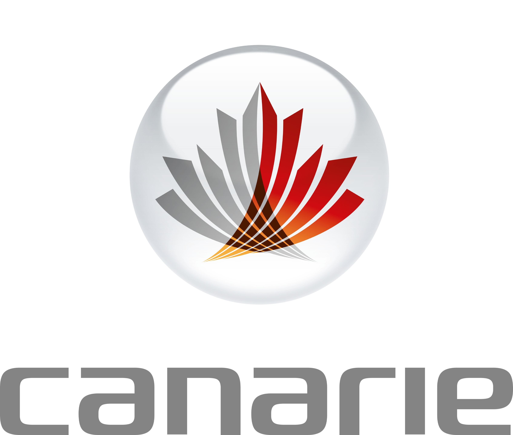
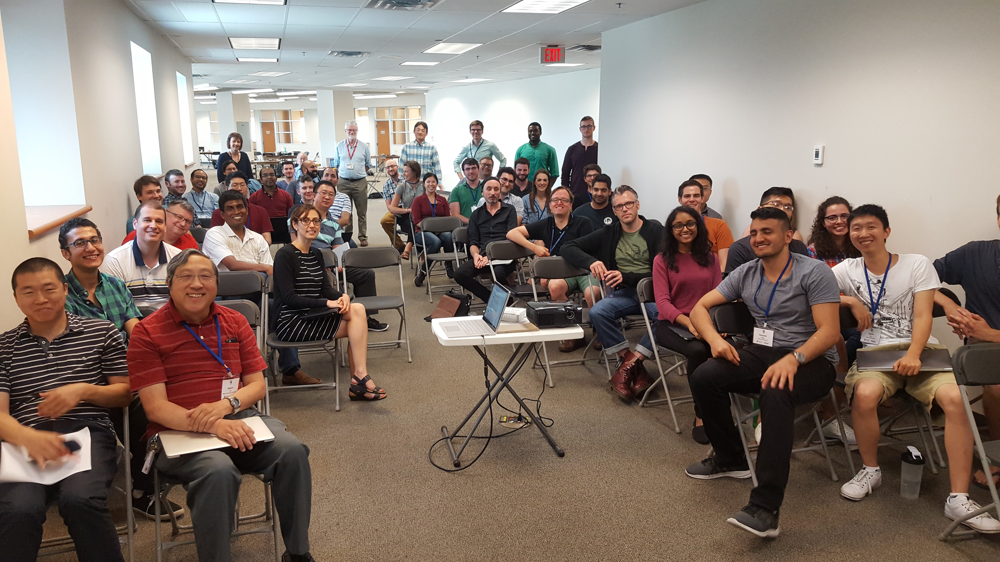

A summary of all past [Project Events](http://wiki.na-mic.org/Wiki/index.php/Project_Events#Past_Project_Weeks).

| | | |
|:---:|:---:|:---:|
|  |  |  |

# 26th Slicer Project Week and 1st Slicer IGT Project Week

It is a pleasure to announce that the Western Slicer Project Week will be held in London, Ontario, Canada on July 17-21, 2017. This is the first extension Slicer project week that grew organically from a proposed visit of Dr. Nobuhiko Hata to Western. Enough interest existed to propose a small Slicer hackfest, which quickly grew into a full blown project week. With the expansion of the hackfest into a full project week, an additional meeting was arranged in conjunction with SPWW to discuss and develop image-guided therapy specific goals. Thus, this is also the inaugural Slicer IGT Project Week.

This project week is an event endorsed by the [MICCAI Society](http://www.miccai.org/organization).

## Feedback
**Please complete the survey [here](https://www.surveymonkey.com/r/ZZ3YH3R).**

## Mailing List
Please send an email to [slicer-project-week-western-join@robarts.ca](mailto:slicer-project-week-western-join@robarts.ca) to be put on the mailing list.

## REGISTRATION
Registration is now closed. For inquiries please contact the organizing committee.

## Local Organizing Committee
* [Terry Peters](http://www.robarts.ca/terry-peters)
* [Jackie Williams](http://www.birc.ca/contact-birc)
* [Ali Khan](https://www.khanlab.ca/)

## Hangouts for Preparation
Bi-weekly Hangouts will be held prior to the event. Please sign up for a Hangout if you have project ideas or suggestions for the event.
* \(Adam Rankin\) Hangout #1: **May 18th 1.00 PM EDT** (GMT-4): Welcome and overview of the project week [event page](https://plus.google.com/u/0/events/cbpe1ku1upiuomv3r6kuea4rnd0)  ([Notes](SPWW_Hangouts_Notes))
* \(Adam Rankin\) Hangout #2: **June 1st 1.00 PM EDT** (GMT-4): VR and Slicer: necessary steps to enable Slicer scene visualization within a VR environment [event page](https://plus.google.com/u/0/events/c0rgj5idnfsdji7tpjr8vu3ekd4)
* (Adam Rankin) Hangout #3: **June 15th 1.00 PM EDT** (GMT-4): Slicelets: You can get rid of those buttons!? [event page](https://plus.google.com/u/0/events/c80d9oit70e6nmmjnssgphv4ggg)

## Accommodation
* Please arrange your own accommodation. Nearby options include:
  * [Western Summer Accommodations](http://www.stayatwestern.ca/)
  * [Guest House on the Mount](http://guesthouseonthemount.ca/)
  * [Windermere Manor](https://windermeremanor.com/)

## Dates
July 17-21, 2017

## Location
[Robarts Research Institute, London, ON, Canada](https://www.google.ca/maps/place/Robarts+Research+Institute,+London,+ON+N6G+2V4/@43.0117945,-81.2759126,17z/data=!3m1!4b1!4m5!3m4!1s0x882eee15f7063301:0xddd8df04a10c8ad7!8m2!3d43.0117613!4d-81.2738213)

[Access via front doors](https://www.google.ca/maps/@43.0113772,-81.2738127,3a,75y,322.68h,82.51t/data=!3m6!1e1!3m4!1svNjMJcK8VMA9V-3RaJci0A!2e0!7i13312!8i6656)

## Resources
This is a collection of resources submitted by attendees
* [Welcome presentation by Andras Lasso](assets/20170717-Robarts-SlicerBasics.pdf)
* [Historical overview by Nobuhiko Hata](assets/2017-slicer.pptx)
* Python resources (thanks John Drozd!)
  * http://cscircles.cemc.uwaterloo.ca/5-input/
  * https://www.jetbrains.com/pycharm/
  * http://www.datacarpentry.org/python-ecology-lesson/

# Schedule
{{#widget:Google Calendar
|id=hegcggqjp16i02rmakfjq4rvk0@group.calendar.google.com
|color=2952A3
|title=Slicer Project Week Western
}}

# Projects
* Use this [updated template for project pages](projects/Project_Week_Template.md)

## Virtual/Augmented Reality
* [Enabling virtual reality (OpenVR) for Slicer](projects/Virtual_Reality_and_Slicer.md) \(Adam Rankin\)

## Segmentation and Classification
* [Identifying angiosomes in the lower leg](projects/Peripheral_Angiosome_Identification.md) \(Michael Schumaker, Andrei Mouraviev, Edward Ntiri\)
* [3D Anatomical Segmentation to Improve Gross Anatomy](projects/3D_Anatomical_Segmentation_to_Improve_Gross_Anatomy.md)_\(Steven Lewis\)
* [Automated Segmentation of the human skull, face and airways from MRI dicom images](projects/Automated Segmentation_of_the_human_skull,_face_and_airways_from_MRI_dicom_images.md) \(John Drozd\)
* [Module for computing Laplace field over a volume of interest](projects/Laplace_equation_solver.md) \(Jordan DeKraker\)
* [Sigmoid Sinus Segmentation](Projects/Sigmoid_Sinus_Segmentation.md) \(Daniel Allen, Brad Gare, Clara Tam\)
* [Auto-segmentation of the uterus in 3D-slicer and bridge to MATLAB](projects/Autosegmentation_of_the_Uterus.md) \(Nadeem Naim\)
* [Vertebral Body Segmentation and Object recognition using Deep Learning Networks](projects/VB_Segmentation_Object_recognition_Deep_Learning.md) \(Michael Hardisty\)
* [Python Phantom Segmentation Script](projects/Python_Phantom_Segmentation_Script.md) \(Colin McCurdy\)
* [Automating semi-automatic ventricle segmentation algorithm](projects/Automating_semi-automatic_ventricle_segmentation_algorithm.md) \(Nuwan Nanayakkara\)

## Image Guided Interventions
* [Prostate Imaging Reporting](projects/PI-RADS_for_MR_Guided_Prostate_Procedures.md) \(Nicole Aucoin, Nobuhiko Hata\)
* [Integration of 3D Slicer and ROS](projects/ROS-IGTL-Bridge.md) \(Junichi Tokuda\)
* [AR-ultrasound module](projects/AR_guidance_system_for_Needle_Interventions.md) \(Goli Ameri, Adam Rankin\)

## Registration
* [4D Registration](projects/CTP_image_registration.md) \(Feng Su, Claire Vannelli, Mohamed Moselhy\)
* [Hand-Eye Calibration Module](projects/hand_eye_calibration.md) \(Isabella Morgan, Elvis Chen\)
* [Ex-vivo to in-vivo Registration Procedure](projects/landmark_registration.md) \(Geetika Gupta\)

## Clinical
* [Image Quizzer](projects/Clinical_Teaching_Tool.md) \(Carol Johnson\)
* [Calculating LVEF](projects/Calculating_LVEF.md) \(Ben Wilk\)
* [sEEG Visuallization](projects/sEEG_visualization.md) \(Kristin Ikeda\)

## Infrastructure
* [CIFTI File Integration Module](projects/CIFTI_File_Integration.md) \(Hossein Rejali\)
* [Dataprobe for models in the 3D viewer](projects/Dataprobe_for_3D_Viewer.md) \(Jason Kai\)

# Breakout sessions
* 3D Slicer introduction
  * [3D Slicer features overview](https://1drv.ms/b/s!Arm_AFxB9yqHsIVjPU5w0WskDFhJsA) \(Andras Lasso\)
* Segmentation
  * [Segment editor tutorials (video tutorial and slides)](https://www.slicer.org/wiki/Documentation/Nightly/Training#Slicer4_3D_Printing)
  * [Segment editor reference manual](http://slicer.readthedocs.io/en/latest/user_guide/module_segmenteditor.html)
* Slicelets
  * [Customizing 3D Slicer: slicelets/guidelets](https://1drv.ms/b/s!Arm_AFxB9yqHsIVkYnMd6OrLmqKMgw) \(Andras Lasso\)]
  * [Slicer programming tutorial](https://www.slicer.org/wiki/Documentation/Nightly/Training#Slicer4_Programming_Tutorial)
  * [VASST Lab Slicelet Template (Thanks Ying Li!)](https://github.com/VASST/SliceletsTemplate)
* SlicerIGT
  * [PerkLab videos](https://www.youtube.com/user/perklabresearch/videos?sort=dd&view=0&shelf_id=0)

# Attendees
* Isabella Morgan (Robarts Research Institute)
* Golafsoun Ameri (Robarts Research Institute)
* Uditha Jayarathne (Robarts Research Institute)
* [Adam Rankin](https://github.com/adamrankin) (Robarts Research Institute)
* Jonathan Lau (Robarts Research Institute)
* Saeed Bakhshmand (CSTAR)
* Serene Abu-Sardanah (Robarts Research Institute)
* Greydon Gilmore (University Hospital)
* John Drozd (Western University)
* Feng Su (Robarts Research Institute)
* Daniel Allen (University of Western Ontario)
* Hossein Rejali (Robarts Research Institute)
* Geetika Gupta (Robarts Research Institute)
* Kristin Ikeda (Western University)
* Kayla Ferko (Western University)
* Jason Kai (Western University)
* Claire Vannelli (Robarts Research Institute)
* Andrew Westcott (Western University)
* Brian Wang (Khan Lab)
* Clara Tam (Western University)
* Loxlan Kasa (Robarts Research Institute)
* Carol Johnson (Baines Imaging Laboratory)
* Benjamin Wilk (Lawson Imaging)
* Andrei Mouraviev (University of Toronto)
* Ali Khan (Western University)
* Colin McCurdy (Western University)
* Reid Vassallo (Robarts Research Institute)
* John Demarco (Robarts Research Institute)
* Michael Schumaker (Sunnybrook Research Institute)
* Erin Iredale (Western University)
* Nobuhiko Hata (Brigham and Women's Hospital and Harvard Medical School)
* Nicole Aucoin (Harmonus Inc)
* Brian Ninni (Surgical Planning Lab)
* Andras Lasso (Queen's PerkLab)
* [Franklin King](https://github.com/franklinwk) (Brigham and Women's Hospital)
* Brad Gare (Western University)
* Steven Lewis (University at Buffalo)
* YingLi Lu (Robarts Research Institute)
* Nuwan Nanayakkara (Robarts Research Institute)
* Hassan Haddad (The University of Western Ontario)
* Junichi Tokuda (Brigham and Women's Hospital)
* Jordan DeKraker (University of Western Ontario)
* Khalid Abdalla (University of Western Ontario)
* Deepak Toor (Robarts Research Institute)
* Justin Michael (Robarts Research Institute)
* Jessica Rodgers (Robarts Research Institute)
* Terry Peters (Robarts Research Institute)
* [Mohamed Moselhy](https://github.com/moselhy), [Email](mailto:mohamed.moselhy@uwo.ca) (McKenzie Lab)
* Nadeem Naim (Mckenzie Lab)
* Edward Ntiri (Sunnybrook Research Institute)
* Helium Mak (Western University)
* Qi Qi (Lawson Imaging)
* Arefin Shamsil (CSTAR)
* Stewart McLachlin (University of Waterloo)
* Michael Hardisty (Sunnybrook Research Institute)
* Wenyao Xia (Western University)
* John Baxter (Robarts Research Institute)
* Jean-Christophe Fillion-Robin (Kitware Inc.)
